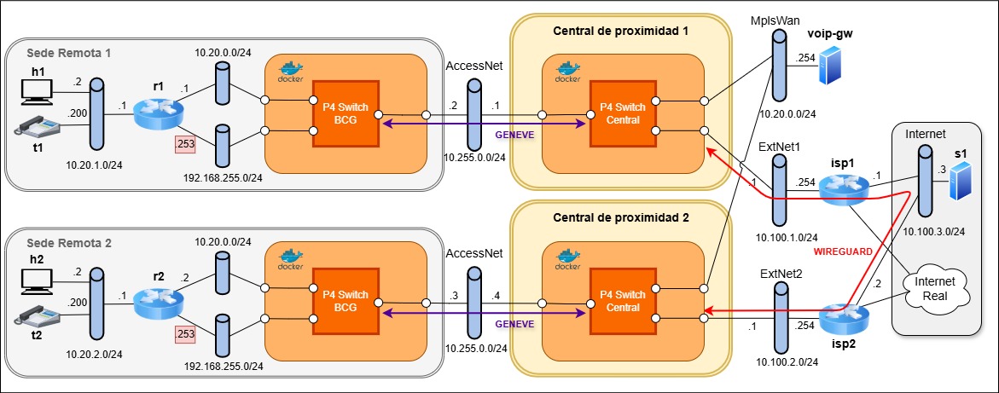

# SD-WAN abierta y programable con P4

Prototipo de laboratorio de una arquitectura **SD-WAN abierta y programable**
construida íntegramente con tecnologías de código abierto. El plano de datos se
implementa con **switches P4** ejecutados sobre **BMv2** (`simple_switch`,
arquitectura `v1model`), desplegados como contenedores Docker.

La solución interconecta **dos sedes de empresa** y clasifica el tráfico en el
propio plano de datos mediante **Geneve con opciones TLV**, transportando cada
clase por el camino que le corresponde:

- **Datos de hosts**: encapsulado en Geneve y cifrado extremo a extremo con **WireGuard**.
- **Telefonía / VoIP**: transporte **MPLS** en crudo (raw L2) sobre `MplsWan`.
- **ARP**: reenvío L2 sobre `MplsWan`.
- **Internet**: salida mediante **NAT** del kernel de Linux a través del CPE.

> Este trabajo se enmarca como **prototipo virtualizado**, orientado a validar el
> diseño y su viabilidad, no como un despliegue de producción.

## 🗺️ Arquitectura



- **Dos sedes remotas** (sede 1 y sede 2), cada una con hosts `h1`/`h2` (PC) y
  teléfonos IP `t1`/`t2`.
- **Switches P4 de borde (BCG, *Bridged Customer Gateway*)**: `p4-bcg-sede1` y
  `p4-bcg-sede2`, que clasifican el tráfico de la sede y aplican la encapsulación
  Geneve con TLV.
- **Switches P4 centrales**: `p4-central-sede1` y `p4-central-sede2`, que
  gestionan el reenvío entre las redes de transporte (WireGuard, MPLS y NAT).
- **Transporte**: túneles **WireGuard** para el tráfico de datos y **MplsWan**
  para telefonía, VoIP y ARP.
- **Internet simulado** con **NAT** del kernel para alcanzar destinos públicos
  (p. ej. `8.8.8.8`).

### Clasificación de tráfico (opciones TLV en Geneve)

| Clase        | TLV          | Transporte                          |
|--------------|--------------|-------------------------------------|
| Hosts/datos  | `0x00000000` | Geneve + WireGuard                  |
| Telefonía    | `0x00000001` | MPLS raw sobre `MplsWan`            |
| ARP          | `0x00000002` | L2 sobre `MplsWan`                  |
| Internet     | `0x00000003` | NAT del kernel (CPE)               |

## 🧩 Puertos de los switches P4

**BCG**

| Puerto | Interfaz          | Red                                            |
|--------|-------------------|------------------------------------------------|
| 0      | `p4bcgX-router`   | `lanX1` — interconexión/MPLS (`10.20.0.0/24`)  |
| 1      | `p4bcgX-access`   | `AccessNetX` — Geneve hacia el central         |
| 2      | `p4bcgX-cpe`      | `lanX2` — Internet/CPE (`192.168.255.0/24`)    |

**Central**

| Puerto | Interfaz        | Red                                              |
|--------|-----------------|--------------------------------------------------|
| 0      | `p4cX-access`   | `AccessNetX`                                     |
| 1      | `p4cX-mpls`     | `MplsWan` — raw L2 (teléfonos/ARP/VoIP)          |
| 2      | `p4cX-tun-in`   | par kernel `p4cX-tun-out` (WireGuard + CPE/NAT)  |

## 📂 Estructura del repositorio

```
.
├── arranque_rdsv_final.sh        # arranque integral del escenario (VNX + Clab)
├── destruir_rsdv_final.sh        # destrucción integral del escenario
├── despliegue_clab.sh            # despliegue del escenario base con Containerlab
├── img/
│   └── p4_switch/
│       ├── bcg_switch.p4         # programa P4 del switch de borde (BCG)
│       ├── central_switch.p4     # programa P4 del switch central
│       ├── compile.sh            # compilación de los programas P4 (p4c → BMv2)
│       ├── deploy.sh             # despliegue de contenedores P4, OVS, WireGuard y NAT
│       └── destroy.sh            # destrucción de los contenedores P4 (no toca VNX)
└── vnx/
    └── sdedge_nfv_sedes.xml      # topología VNX de las dos sedes
```

## 🚀 Despliegue

El escenario se apoya en un entorno base heredado de la práctica de la asignatura
**RDSV** (VNF sobre Kubernetes, VNX y Containerlab), sobre el que se integran los
switches P4 desarrollados en este trabajo.

```bash
# 1. Arranque integral del escenario base (VNX + Containerlab + VNF)
./arranque_rdsv_final.sh

# 2. Compilar los programas P4
cd img/p4_switch
./compile.sh

# 3. Desplegar los switches P4, WireGuard y NAT
./deploy.sh
```

Para destruir únicamente los contenedores P4 (dejando el escenario base activo):

```bash
./destroy.sh
```

## 🛠️ Tecnologías

- **Plano de datos**: P4 (`p4c`), BMv2 (`simple_switch`, `simple_switch_CLI`), arquitectura `v1model`
- **Encapsulación y cifrado**: Geneve (RFC 8926) con opciones TLV, WireGuard, MPLS
- **Infraestructura**: Docker, Open vSwitch, VNX, Containerlab, Linux network namespaces
- **NAT**: `iptables` / kernel de Linux
- **Medidas**: `iperf`, `ping`, `tcpdump`, `ethtool`
